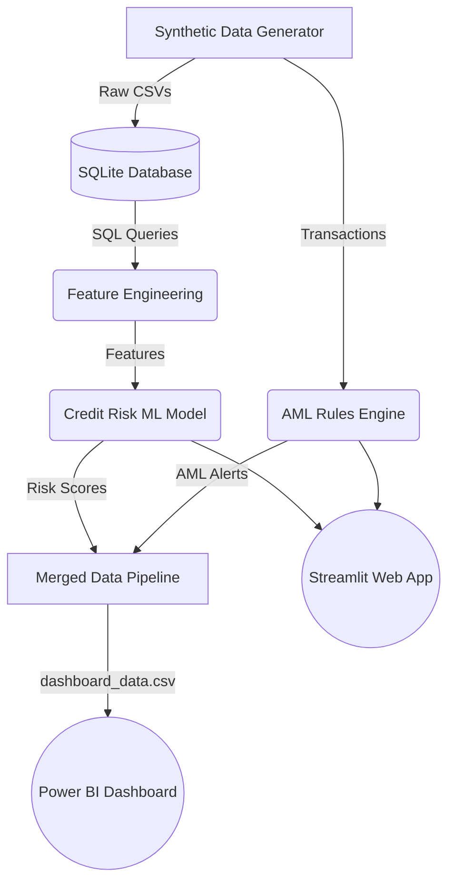
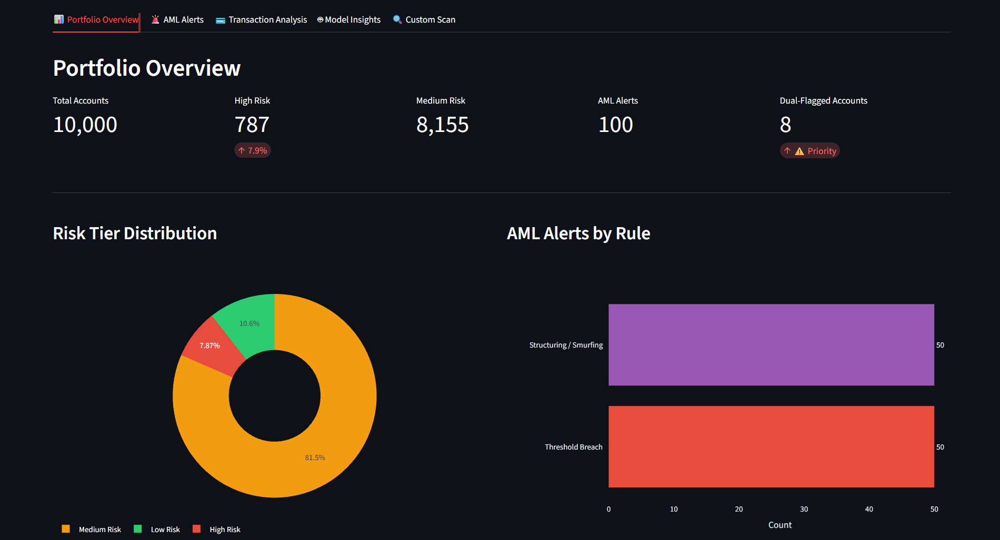
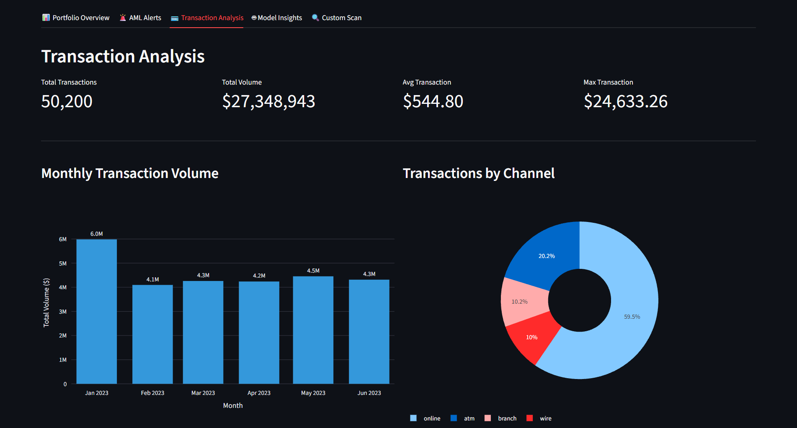
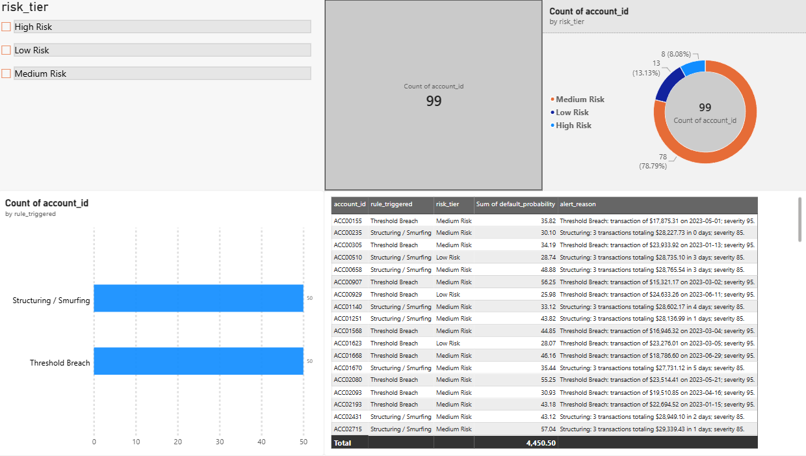

# CredWatch — Transaction Monitoring & Credit Risk Analytics Suite


## Overview

CredWatch is a Python/SQLite analytics pipeline that unifies **AML (Anti-Money Laundering) transaction monitoring** with **ML-based credit risk scoring**. It uses a JSON-configurable rule engine, a Logistic Regression default-probability model, a Streamlit web dashboard, and a Power BI report for unified risk visibility across a synthetic 10,000-account banking portfolio.

---

## Architecture & Data Flow



---

## Screenshots

### 1. Streamlit Dashboard — Portfolio Overview


### 2. Streamlit Dashboard — Transaction Analysis


### 3. Unified Power BI Report


---

## Components

| # | Component | Description |
|---|-----------|-------------|
| 1 | **Synthetic Data Generator** | Generates 10,000-account, 50,200-transaction dataset with injected structuring/smurfing typologies |
| 2 | **SQL Analytical Layer** | CTEs and window functions in SQLite for rolling transaction velocity |
| 3 | **Configurable Rule Engine** | Thresholds in `rules_config.json`; evaluates transactions, scores severity, deduplicates alerts |
| 4 | **Credit Risk ML Model** | Logistic Regression predicting loan default probability bucketed into Low/Medium/High risk tiers |
| 5 | **Streamlit Web App** | Interactive dashboard — Portfolio Overview, AML Alerts, Custom Risk Scan |
| 6 | **Unified Reporting** | Jupyter EDA notebook and Power BI dashboard joining alerts with ML risk tiers |

---

## Results

| Metric | Result |
| :--- | :--- |
| Accounts scanned | 10,000 |
| Transactions monitored | 50,200 |
| AML alerts generated | 100 (50 structuring, 50 threshold breach) |
| ML model accuracy | 72% (F1: 0.40 on defaults) |
| Top risk predictors | LTI Ratio (coef ~0.65), Existing Defaults (coef ~0.33) |

---

## Project Structure

```text
credwatch/
├── assets/                          # Screenshots for README
├── credit_risk_model/
│   ├── feature_engineering.py       # Prepares loan data for ML
│   └── train_model.py               # Trains Logistic Regression, saves model
├── dashboard/
│   ├── PowerBI_Instructions.md      # Steps to open/build the .pbix
│   ├── credwatch_dashboard.pbix     # Power BI report file
│   └── prepare_dashboard_data.py    # Merges ML + AML data for Power BI
├── data/
│   ├── raw/
│   │   └── generate_data.py         # Synthetic data generator (run first)
│   └── processed/                   # Generated outputs (gitignored)
├── notebooks/
│   └── eda_and_validation.ipynb     # Exploratory data analysis
├── rules_engine/
│   ├── rules_config.json            # Editable AML rule thresholds ← configure here
│   └── rules_engine.py              # Applies rules, deduplicates, outputs alerts
├── sql/
│   ├── 01_schema.sql                # SQLite table definitions
│   ├── 02_load_data.py              # Loads CSVs into SQLite
│   └── 03_risk_queries.sql          # CTEs and window functions for aggregation
├── streamlit_app.py                 # Interactive Streamlit dashboard
├── run_all.py                       # ⚡ End-to-end pipeline runner
├── run_sql_queries.py               # Standalone SQL query runner
├── business_memo.md                 # Executive recommendation memo
└── requirements.txt                 # Python dependencies
```

> **Note:** All files under `data/processed/`, `*.pkl`, `*.db`, and generated CSVs are gitignored — they are produced by running the pipeline.

---

## Prerequisites

- **Python 3.10+** — [Download](https://www.python.org/downloads/)
- **pip** (bundled with Python)
- **Power BI Desktop** (optional, for the Power BI dashboard) — [Download](https://powerbi.microsoft.com/desktop/)

---

## Installation

```bash
# 1. Clone the repository
git clone https://github.com/<your-username>/credwatch.git
cd credwatch

# 2. Create and activate a virtual environment
python -m venv venv

# On Windows:
venv\Scripts\activate

# On macOS/Linux:
source venv/bin/activate

# 3. Install dependencies
pip install -r requirements.txt
```

---

## Usage

### Option A — Run the full pipeline (recommended)

This single command runs all 7 pipeline stages in order:

```bash
python run_all.py
```

Pipeline stages:
1. Generate synthetic banking data (`data/raw/loans.csv`, `transactions.csv`)
2. Load data into SQLite (`data/processed/credwatch.db`)
3. Execute SQL risk queries
4. Feature engineering for ML model
5. Train Logistic Regression credit risk model → saves `model.pkl`
6. Run AML rules engine → saves `alerts_output.csv`
7. Prepare merged data for Power BI → saves `dashboard_data.csv`

### Option B — Launch the Streamlit dashboard

After running the pipeline, start the interactive web app:

```bash
streamlit run streamlit_app.py
```

Then open [http://localhost:8501](http://localhost:8501) in your browser.

### Option C — Run stages individually

```bash
# Generate data only
python data/raw/generate_data.py

# Load into SQLite only
python sql/02_load_data.py

# Run rules engine only
python rules_engine/rules_engine.py
```

---

## Configuration

AML rule thresholds are fully configurable in [`rules_engine/rules_config.json`](rules_engine/rules_config.json):

```json
{
  "rules": [
    {
      "rule_id": "R001",
      "rule_name": "Structuring / Smurfing",
      "parameters": { "min_amount": 9000, "max_amount": 9999, "min_count": 3, "time_window_days": 7 },
      "severity_score": 85
    },
    {
      "rule_id": "R002",
      "rule_name": "Velocity Anomaly",
      "parameters": { "max_daily_transactions": 5 },
      "severity_score": 60
    },
    {
      "rule_id": "R003",
      "rule_name": "Threshold Breach",
      "parameters": { "threshold_amount": 15000 },
      "severity_score": 95
    }
  ]
}
```

Edit the `parameters` values and re-run `python rules_engine/rules_engine.py` to apply changes.

---

## Power BI Dashboard

See [`dashboard/PowerBI_Instructions.md`](dashboard/PowerBI_Instructions.md) for step-by-step instructions on opening and refreshing the `.pbix` report after generating `dashboard_data.csv`.

---

## Data

All data is **fully synthetic**, generated via `data/raw/generate_data.py` using `numpy` and `pandas` with a fixed seed (`42`) for reproducibility. Structuring and threshold-breach typologies are explicitly injected as ground-truth anomalies for validating the rule engine.

No real customer data is used or included.

---

## License

This project is licensed under the [MIT License](LICENSE).

---

## Author

**Arnab Karmakar**  
*Electrical Engineer | NIT Durgapur*  
✉️ Email: [arnabkarmakar7980@gmail.com](mailto:arnabkarmakar7980@gmail.com)  
🔗 LinkedIn: [arnab-karmakar08](https://www.linkedin.com/in/arnab-karmakar08)  
🔗 GitHub: [@ArnabK08](https://github.com/ArnabK08)
